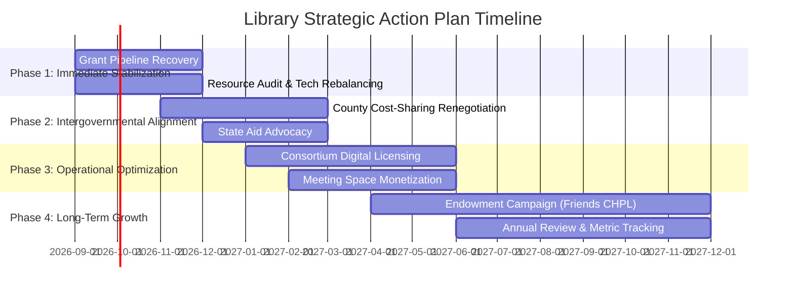

# Strategic Recovery & Action Plan: Chapel Hill Public Library

This document outlines a structured, multi-phase plan to address revenue stagnation, rising fixed costs, and operational downsizing at the Chapel Hill Public Library based on the FY 2025–26 Adopted Budget findings.

---

## 🎯 Plan Objectives

1. **Revenue Diversification**: Expand non-General Fund revenue from the current ~16% to at least 25% of total budget.
2. **Rebuilding External Grants**: Restore annual project grant funding from $0 back to $100K+ annually.
3. **Equitable County Cost-Sharing**: Renegotiate the flat $621,323 Orange County contribution to an indexed funding formula.
4. **Service & Collection Reinvestment**: Increase materials spending from 6% to the 10% state benchmark and restore technology lending capacity.

---

## 🗓️ Phased Implementation Roadmap

---

### Phase 1: Immediate Revenue Stabilization & Pipeline Recovery (Months 1–3)

* **Action 1.1: Re-establish the Grant Application Workflow**
  - Designate a grant coordinator within existing administrative staff to target federal (IMLS), state (LSTA), and philanthropic grants.
  - Set an initial FY27 grant acquisition target of **$75,000–$100,000** to replace the $0 budget allocation.
* **Action 1.2: Audit Technology Lending & Public Computing**
  - Diagnose causes of the ~65% drop in technology lending circulation (equipment aging vs. policy restrictions).
  - Deploy refreshed, grant-funded mobile hotspots and loaner devices.

---

### Phase 2: Intergovernmental Funding Renegotiation (Months 3–6)

* **Action 2.1: Orange County Cost-Sharing Agreement Review**
  - Present data to the Board of County Commissioners demonstrating county resident usage vs. municipal funding.
  - Propose transitioning the flat **$621,323** allocation to a per-patron or per-capita formula with annual inflation adjustments (CPI-linked).
* **Action 2.2: State Aid Alignment**
  - Coordinate with NC State Library representatives to maximize state aid qualification and categorical literacy grants.

---

### Phase 3: Operational Efficiency & Facility Monetization (Months 6–12)

* **Action 3.1: Regional Consortium Digital Purchasing**
  - Join or expand regional eBook / database consortium purchasing networks (e.g., NC Cardinal / shared OverDrive collections).
  - Reduce digital licensing overhead by 15–20%, redirecting savings directly to physical collections.
* **Action 3.2: Commercial & After-Hours Facility Rental Program**
  - Update meeting room policies to allow tiered corporate/private rental rates during off-peak and evening hours.
  - Target a modest annual non-tax revenue generation of **$25,000–$40,000**.

---

### Phase 4: Long-Term Sustainability & Endowment Building (Year 2+)

* **Action 4.1: Foundation Endowment Campaign**
  - Partner with the *Friends of Chapel Hill Public Library* to launch a 3-year planned giving / endowment campaign.
  - Goal: Build a dedicated endowment generating **$50,000+** in annual interest income for materials and innovations.
* **Action 4.2: Permanent Staffing & Compensation Review**
  - Benchmark staffing allocations to ensure specialist FTEs (such as Library Experience Specialists) are maintained without reliance on temporary attrition.

---

## 📈 Key Performance Indicators (KPIs) & Target Metrics

| Metric | Baseline (FY25/FY26) | 1-Year Target (FY27) | 3-Year Target (FY29) |
| :--- | :--- | :--- | :--- |
| **External Grant Revenues** | $0 | $75,000 | $120,000+ |
| **County Funding Contribution** | $621,323 (Flat) | $675,000 (Indexed) | $750,000+ |
| **Collection Budget (% of OpEx)**| 6.1% | 8.0% | **10.0%** (State Standard) |
| **Technology Lending Items** | 671 items | 1,200 items | 2,000+ items |
| **Visits Per Capita** | 3.94 | 4.50 | 5.50+ |
| **Endowment Annual Yield** | ~$1,400 | $15,000 | $50,000+ |

---

## 👥 Stakeholder Responsibilities Matrix

| Stakeholder Group | Primary Responsibilities |
| :--- | :--- |
| **Library Leadership** | Operational execution, grant applications, consortium integration. |
| **Town Council / Management** | Budget prioritization, county agreement renegotiation approval. |
| **Orange County Commissioners**| Approving fair cost-sharing formulas for non-municipal users. |
| **Friends of CHPL / Foundation**| Capital campaigns, donor stewardship, endowment fundraising. |
| **Community / Patrons** | Program participation, feedback, community advocacy. |

---

## ⚠️ Risk Management & Mitigation

| Potential Risk | Severity | Mitigation Strategy |
| :--- | :--- | :--- |
| **County rejects cost-sharing renegotiation** | High | Present detailed patron zip-code data; propose multi-year phased adjustment. |
| **Grant applications unsuccessful** | Medium | Partner with university research groups and regional literacy non-profits for joint proposals. |
| **Continued benefit/healthcare inflation** | High | Explore energy efficiency and automated workflow savings to offset fixed personnel increases. |
